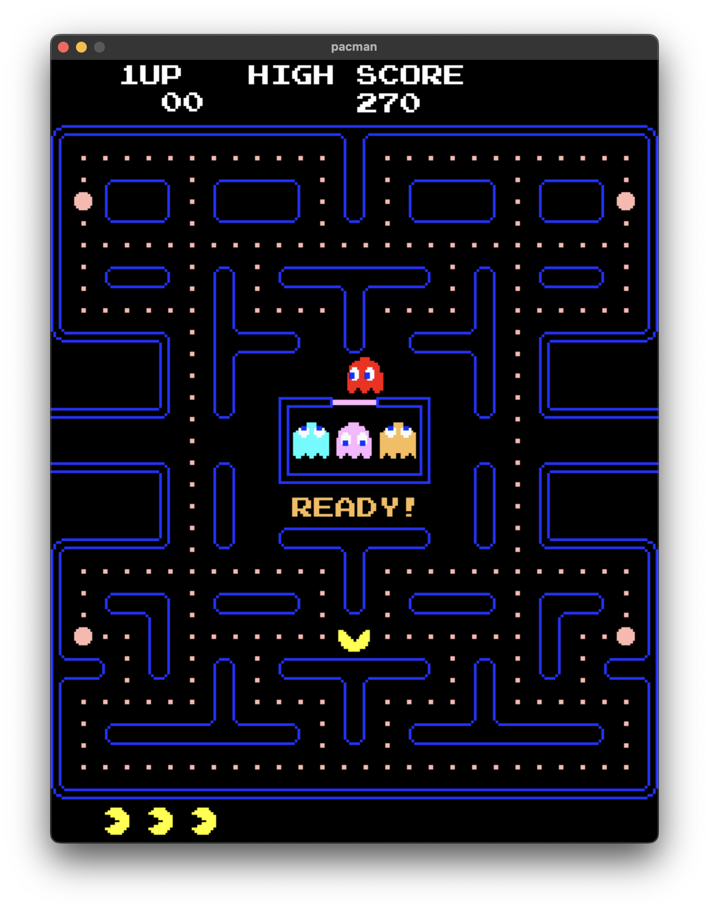

# Pacman

This is pacman clone written in C++ with SDL lib.

## Build
##### Linux/Mac
First you need to install dependencies: SDL, SDL_image, SDL_mixer, SDL_ttf. 

Then build with:
```
make
```
Run the executable:
```
./a.out
```

